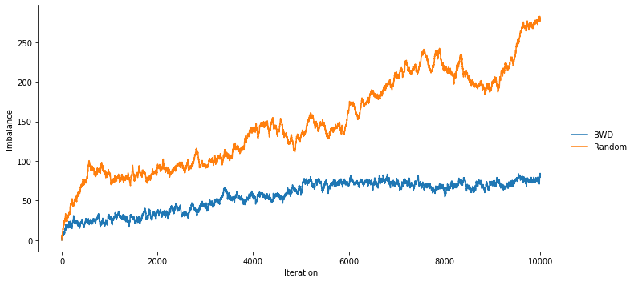

# Balancing Walk Design

[](code_of_conduct.md)
[](https://github.com/ddimmery/balancer-package/actions/workflows/ci.yml)

This package provides a reference implementation of the [Balancing Walk Design](https://arxiv.org/abs/2203.02025). It relies on minimal dependencies and is intended to be an easy way to plug in advanced experimental designs into existing systems with little overhead.

More details on the design of the method on the [About page](about) and in the [paper](https://arxiv.org/abs/2203.02025). An [example of usage is below](#usage).

## Installation

(packages not yet available)

With `pip`:

```
pip install balancer
```

With `conda`:
```
conda install -c conda-forge balancer
```


## Usage

Eventually this will contain code examples and a simple demonstration of the method, like the following:


```python
from balancer import BWD
from numpy.random import default_rng
import numpy as np
rng = default_rng(2022)

n = 10000
d = 5
ate = 1
beta = rng.normal(size = d)

X = rng.normal(size = (n, d))

balancer = BWD(N = n, D = d)
A_bwd = []
A_rand = []
imbalance_bwd = np.array([[0] * d])
imbalance_rand = np.array([[0] * d])

increment_imbalance = lambda imba, a, x: np.concatenate([imba, imba[-1:, :] + (2 * a - 1) * x])

for x in X:
    # Assign with BWD
    a_bwd = balancer.assign_next(np.concatenate([[1], x]))
    imbalance_bwd = increment_imbalance(imbalance_bwd, a_bwd, x)
    A_bwd.append(a_bwd)
    # Assign with Bernoulli randomization
    a_rand = rng.binomial(n = 1, p = 0.5, size = 1).item()
    imbalance_rand = increment_imbalance(imbalance_rand, a_rand, x)
    A_rand.append(a_rand)

# Outcomes are only realized at the conclusion of the experiment
eps = rng.normal(size=n)
Y_bwd = X @ beta + A_bwd * ate + eps
Y_rand = X @ beta + A_rand + ate + eps
```

We can see how imbalance progresses as a function of time:


```python
import seaborn as sns
import pandas as pd

norm_bwd = np.linalg.norm(imbalance_bwd, axis = 1).tolist()
norm_rand = np.linalg.norm(imbalance_rand, axis = 1).tolist()

sns.relplot(
    x=list(range(n + 1)) * 2, y=norm_bwd + norm_rand,
    hue = ["BWD"] * (n + 1) + ["Random"] * (n + 1),
    kind="line", height=5, aspect=2,
).set_axis_labels("Iteration", "Imbalance");
```


    

    


It's clear from the above chart that using BWD keeps imbalance substantially more under control than standard methods of randomization.

## Citation
APA:
> Arbour, D., Dimmery, D., Mai, T., & Rao, A. (2022). *Online Balanced Experimental Design*. arXiv preprint arXiv:2203.02025.

BibTeX:
```
@misc{https://doi.org/10.48550/arxiv.2203.02025,
  doi = {10.48550/ARXIV.2203.02025},
  url = {https://arxiv.org/abs/2203.02025},
  author = {Arbour, David and Dimmery, Drew and Mai, Tung and Rao, Anup},
  keywords = {Methodology (stat.ME), FOS: Computer and information sciences, FOS: Computer and information sciences},
  title = {Online Balanced Experimental Design},
  publisher = {arXiv},
  year = {2022},
  copyright = {arXiv.org perpetual, non-exclusive license}
}
```
