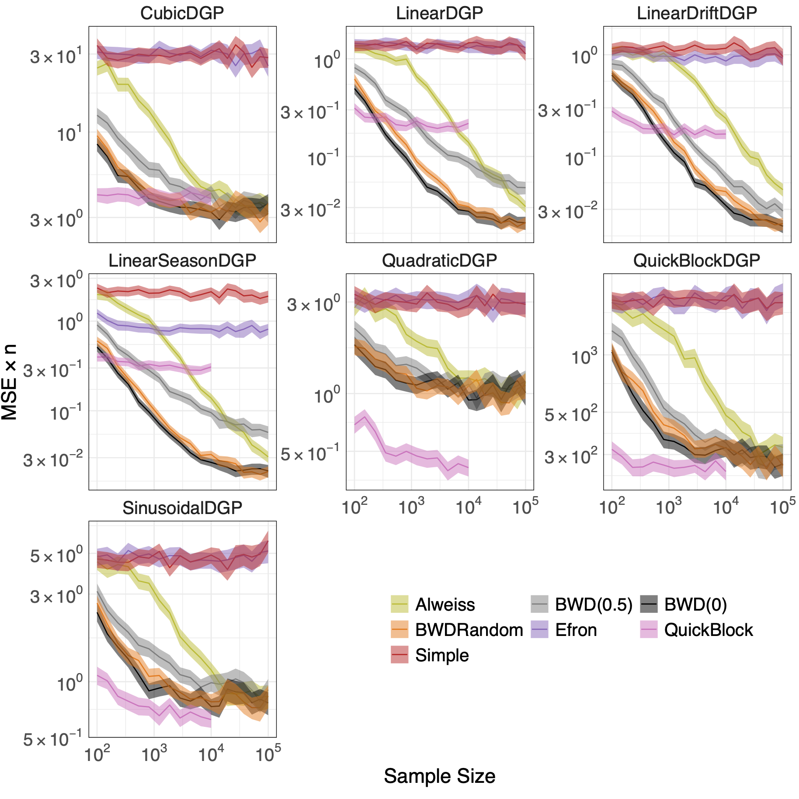
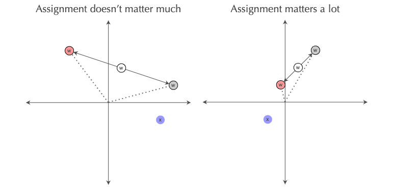
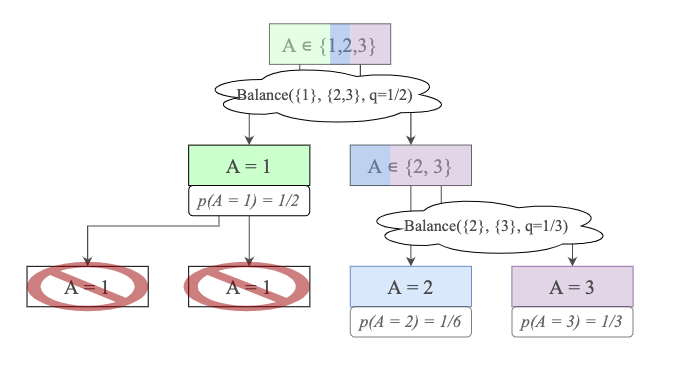

---
hide:
  - navigation
---

## About the method

You can [read the preprint on arXiv](https://arxiv.org/abs/2203.02025).

The abstract is:

> We consider the experimental design problem in an online environment, an important practical task for reducing the variance of estimates in randomized experiments which allows for greater precision, and in turn, improved decision making. In this work, we present algorithms that build on recent advances in online discrepancy minimization which accommodate both arbitrary treatment probabilities and multiple treatments. The proposed algorithms are computational efficient, minimize covariate imbalance, and include randomization which enables robustness to misspecification. We provide worst case bounds on the expected mean squared error of the causal estimate and show that the proposed estimator is no worse than an implicit ridge regression, which are within a logarithmic factor of the best known results for offline experimental design. We conclude with a detailed simulation study showing favorable results relative to complete randomization as well as to offline methods for experimental design with time complexities exceeding our algorithm.

In short: efficient experimental design in the online setting which maintains strong worst-case guarantees.

{: style="max-height:500px; display: block; margin-left: auto; margin-right: auto;"}

### Intuition

When a covariate profile aligns with the direction of previously observed imbalance, we have an opportunity to decrease imbalance by assigning treatment to push imbalance towards zero. Thus, we do that with slightly higher probability.

{: style="display: block; margin-left: auto; margin-right: auto;"}

This geometric intuition can be formalized by assigning treatment generally based on the dot-product between these two vectors:

$$x \cdot w = ||x|| \cdot ||w|| \cos \theta \leq ||w|| \cos \theta$$

where the final inequality comes from the fact that we assume covariate profiles are normalized. Thus, modifying treatment probability proportionally to the dot product obeys the exact geometric property we care about: treatment assignment is pushed farther away from the marginal when there's more opportunity to reduce the magnitude of $w$.

To extend this approach to unequal probabilities of treatment requires weighting the observed imbalances. The extension to multiple treatments relies on building a binary tree where each node represents the (weighted) balance problem between two *sets* of treatment.

{: style="display: block; margin-left: auto; margin-right: auto;"}

## About us

Check us out in our respective corners of the internet:

- [David Arbour](https://darbour.github.io/)
- [Drew Dimmery](http://ddimmery.com)
- [Tung Mai](https://sites.google.com/view/tungtmai/)
- [Anup Rao](https://sites.google.com/site/anupraob/)
